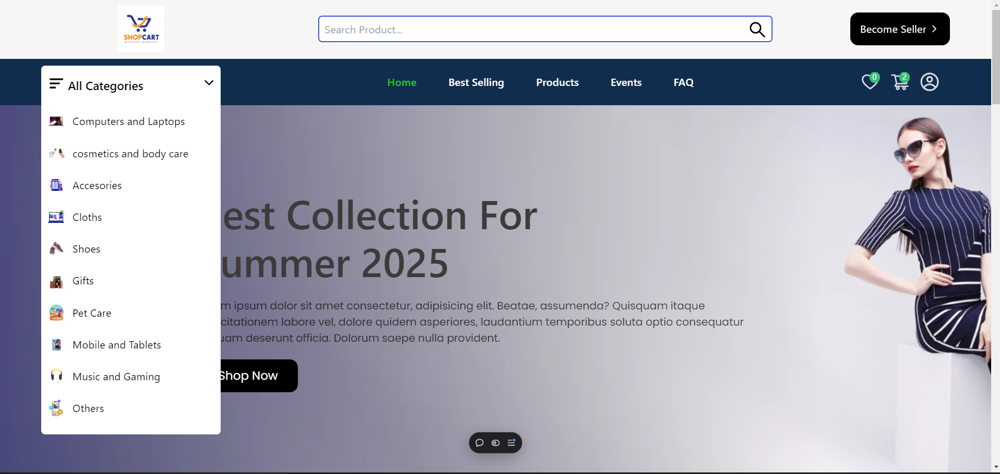
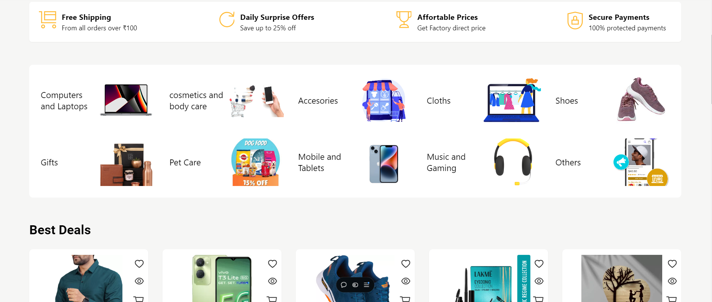
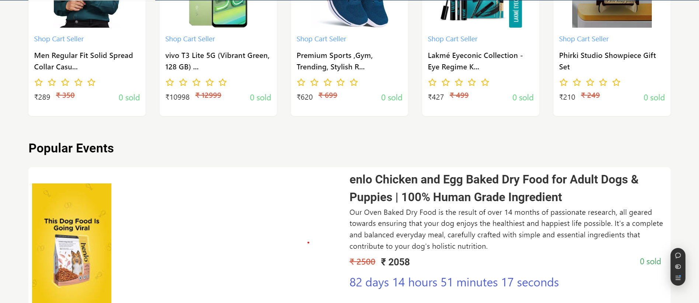
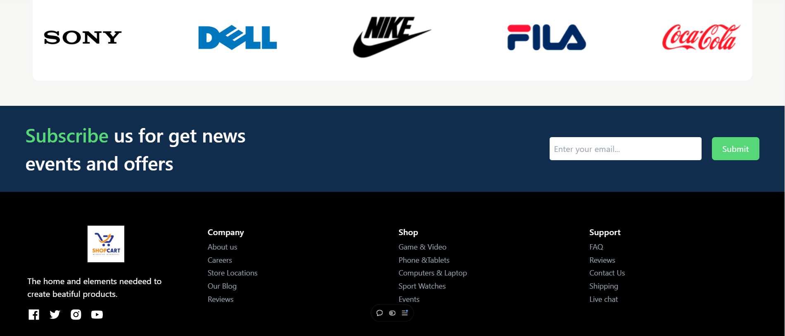
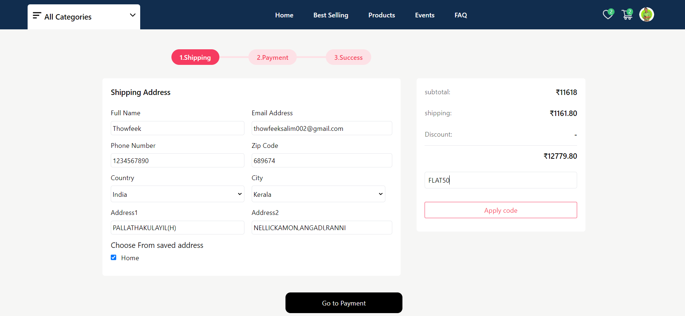
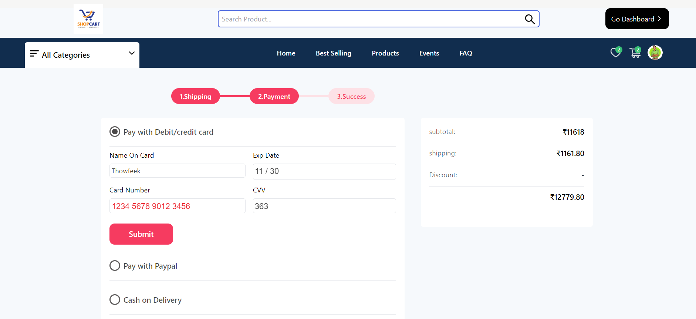
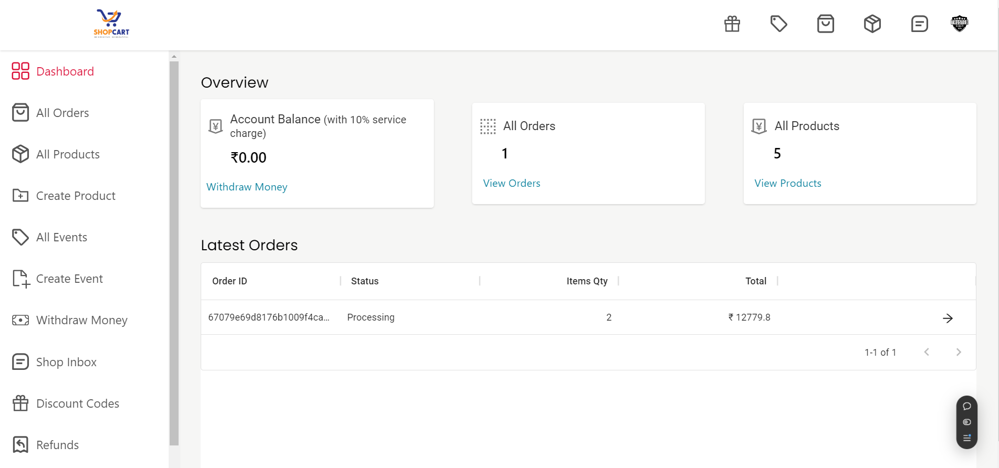

---





# 🛒 ShopCart

🔗 **Live Demo**: [ShopCart Live](https://tshop-przo.vercel.app/)

## 📖 Project Overview

ShopCart is a full-featured e-commerce web application built with the MERN stack (MongoDB, Express.js, React.js, Node.js). This platform allows users to browse products, add items to the cart, and make payments seamlessly. Additionally, it includes live chat functionality and supports real-time communication using Socket.io.

## ✨ Features

- 🛍️ **Product Listings**: Browse through various products with detailed descriptions.
- 🛒 **Add to Cart**: Easily add items to the cart and proceed to checkout.
- 💳 **Payment Gateway Integration**: Secure payments powered by modern gateways for smooth transactions.
- 🔐 **User Authentication & Authorization**: Protect user data with JWT-based secure authentication.
- 📊 **Admin Panel**: Manage products, users, and orders with an intuitive admin dashboard.
- 💬 **Live Chat**: Real-time customer support and user interaction via live chat.
- ⚡ **Real-time Updates**: Instant updates for chat and dynamic content, powered by Socket.io.

## 💻 Technologies Used

- 🗄️ **MongoDB**: For database management, efficiently handling product, user, and order data.
- 🧑‍💻 **Express.js**: Backend framework for building RESTful APIs and handling server-side logic.
- ⚛️ **React.js**: Frontend framework for building fast and responsive user interfaces.
- 🌐 **Node.js**: Powering the server-side operations, ensuring scalability and performance.
- 📡 **Socket.io**: Enables real-time communication for features like live chat.
- 💵 **Payment Gateway Integration**: Secure and reliable payment process for customers.
- 🚀 **Vercel**: Fast and easy deployment for seamless project management.

## 🛠️ Setup Instructions

1. Clone the repository:
   ```bash
   git clone https://github.com/thowfeek-dev/tshop.git
   cd tshop
   ```

2. Install dependencies:
   ```bash
   npm install
   ```

3. Create a `.env` file in the root directory and add your environment variables:
   ```bash
   MONGO_URI=your_mongo_uri
   JWT_SECRET=your_jwt_secret
   ```

4. Start the development server:
   ```bash
   npm run dev
   ```

## 🌐 Live Demo

Explore the live version of ShopCart at [https://tshop-przo.vercel.app/](https://tshop-przo.vercel.app/).





---